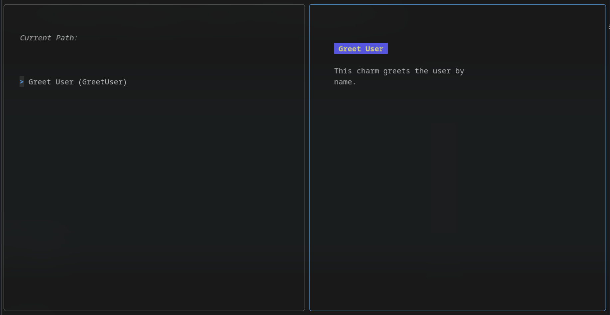

# Charmer

- :sparkles: **Simple Integration**  
  Just annotate your functions with `@Charm`

- :evergreen_tree: **Automatic TUI Generation**  
  Create hierarchical menus with zero UI code

- :zap: **Charm-Powered**  
  Built on the robust Bubbles and BubbleTea libraries

- :memo: **Documentation-Driven**  
  Use annotations to define your CLI structure

- :rocket: **Focus on Logic**  
  Write your functions, let Charmer handle the UI

---

## What is Charmer?

Charmer is a Go package that automatically generates Terminal User Interfaces (TUIs) from your Go functions. Powered
by [Charm](https://github.com/charmbracelet) libraries, it transforms annotated functions into beautiful, navigable
command-line interfaces without the hassle of UI implementation.



## Why Use Charmer?

Developing beautiful terminal interfaces typically requires extensive UI code. Charmer eliminates this burden by
automatically generating interactive TUIs from your Go functions, allowing you to focus on your application's core
functionality.

```go
package charms

import "fmt"

// @Charm
// @Title Greet User
// @Description
// # Greet User
// This charm greets the user by name.
func GreetUser(name string) {
	fmt.Printf("Hello, %s! Welcome to Charmer!\n", name)
}
```

*Just add annotations, and Charmer generates the rest!*

## Quick Start

### Install Charmer

```bash
go get github.com/ImGajeed76/charmer@latest
```

> **Note:** You maybe have to run `go mod tidy` to update your `go.mod` file after installing Charmer.

### Create Your First Charm

```go
//go:generate go run github.com/ImGajeed76/charmer/tools/generate

package main

import (
	"your-project/internal/registry"
	"github.com/ImGajeed76/charmer/pkg/charmer"
)

func main() {
	charmer.Run(registry.RegisteredCharms)
}
```

### Generate & Run

```bash
go generate
go run main.go
```

> **Tip:** Instead of running `go run main.go`, run `go build` to create a standalone binary and execute it in your
> favorite terminal.

## Development Status

!!! warning "Early Alpha Stage"

    This project is currently in early development. Features and APIs may change significantly. The current version might not be fully functional as package publishing is still being configured.

## License

This project is licensed under the GNU General Public License v3.0.

## Acknowledgments

- Built with ❤️ in Switzerland by ImGajeed76
- Powered by the amazing [Charm](https://github.com/charmbracelet) libraries

---

!!! tip "Purpose"

    Simplifying the creation of beautiful terminal utility applications, one function at a time.